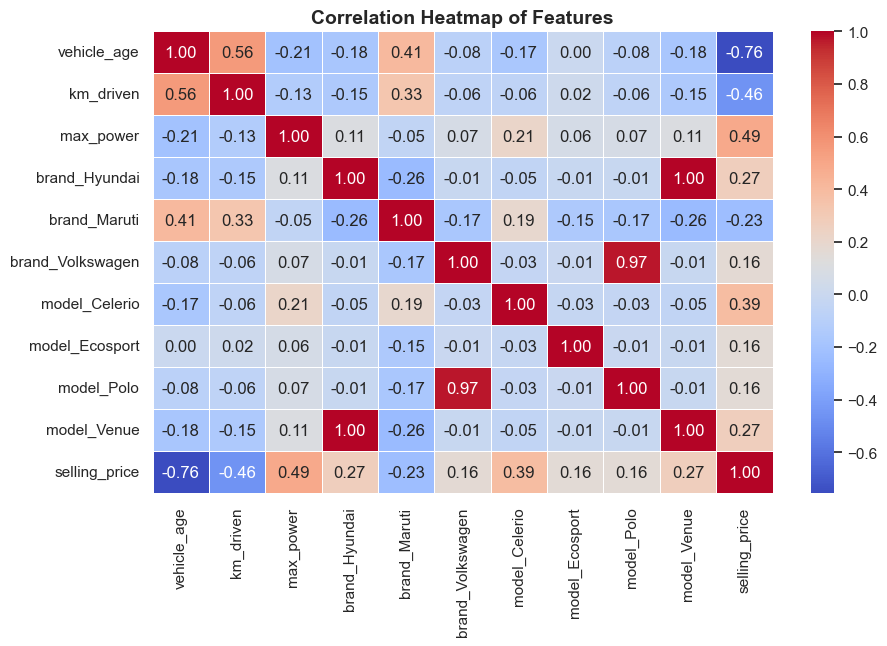
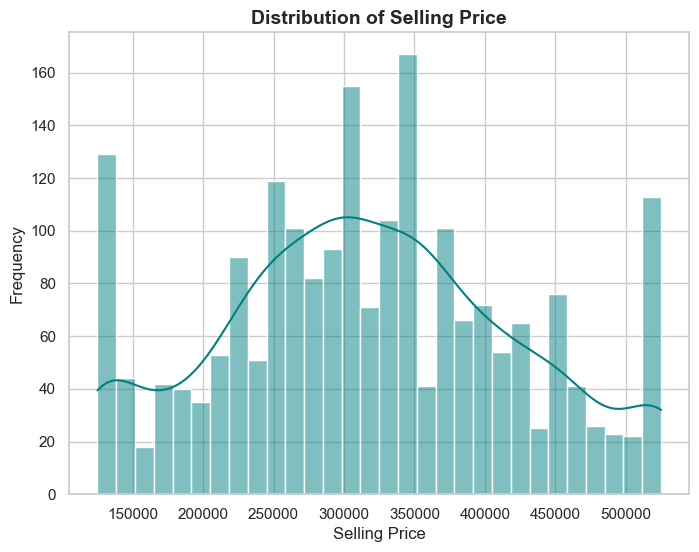
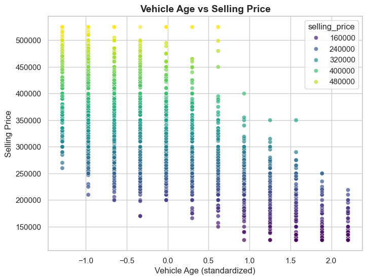

#  Car Data Exploratory Data Analysis (EDA)

This project explores and analyzes a dataset of cars to understand the factors affecting **selling price**.  
Through **data preprocessing, feature engineering, and visualization**, we identify key patterns and relationships that influence vehicle pricing.

---

##  Project Structure

```
EDA/
│── car_data.csv # Raw dataset
│── EDA.ipynb # Jupyter Notebook with the analysis
│── images/ # Saved visualizations
├── heatmap.png
├── price_distribution.png
├── age_vs_price.png
├── power_vs_price.png
```

---

## Steps Performed

1. **Data Cleaning**
   - Checked for missing values (none found ).
   - Removed constant features (e.g., `seats`).

2. **Outlier Detection & Handling**
   - Used boxplots and Z-scores.
   - Identified extreme values in mileage, max_power, and price.

3. **Feature Scaling**
   - Standardized numerical features for consistency.

4. **Encoding Categorical Variables**
   - Applied **One-Hot Encoding** for `brand` and `model`.

5. **Feature Selection**
   - Selected top features using `SelectKBest` (F-regression).

6. **Visualization**
   - Explored trends, correlations, and price distributions.

---

##  Key Visualizations

### 1. Correlation Heatmap of Features  
Shows relationships between numerical variables and selling price.  


---

### 2. Distribution of Selling Price  
Reveals skewness in the target variable — most cars sell at lower price ranges.  


---

### 3. Vehicle Age vs Selling Price  
Older vehicles depreciate in value as expected.  


---

### 4. Max Power vs Selling Price  
Cars with higher max power generally have higher selling prices.  


---

## Conclusions

- **Vehicle Age** is a strong negative predictor of selling price.  
- **Max Power** shows a positive relationship — more powerful cars sell at higher prices.  
- **Brands** (e.g., Hyundai, Maruti, Volkswagen) significantly influence pricing.  
- The dataset is skewed towards **budget-friendly cars**, with fewer high-end entries.  

---

**Author:**  Levi Mulama.
- Aspiring **Data Analyst | IT Personnel | Data Science Enthusiast**